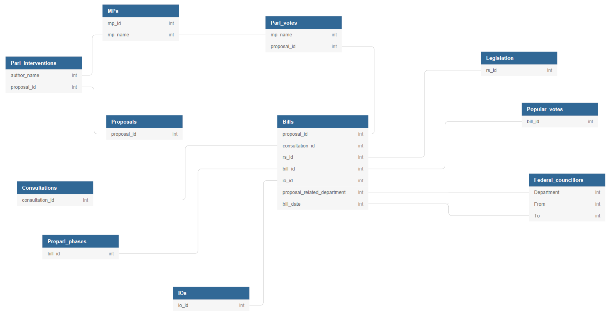

# Legpro
Legpro is a relational database which is an output of the project ``Re-parliamentarization? A quantitative assessment of the Swiss
Parliament's legislative function, 1987-2015'' funded by the Swiss National Science Fundation.  
Authors: [Pascal Sciarini](mailto:pascal.sciarini@unige.ch), [Roy Gava](mailto:roy.gava@unige.ch), [Julien Jaquet](mailto:julien.jaquet@unige.ch)

Please use the following citation if you use the data:  
Sciarini, Pascal, Gava, Roy and Jaquet, Julien M. (2018). Swiss Legislative Processes
(1987-2015) (LegPro) [database]. Department of Political Science and International Relations,
University of Geneva.

  

