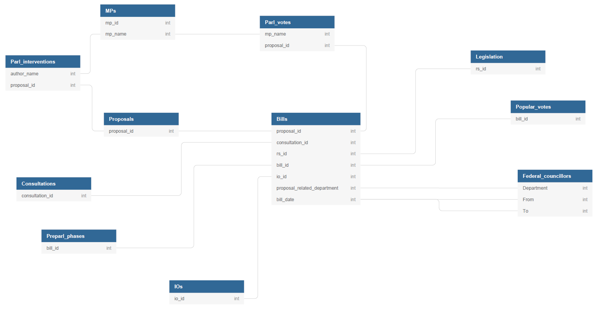

# Swiss Legislative Processes Codebook (LegPro)

<b>Authors:</b> 
<b><a href="https://unige.ch/sciences-societe/speri/membres/pascal-sciarini/">Pascal Sciarini</a></b> 
<b><a href="http://roygava.com/">Roy Gava</a></b> 
<b><a href="https://www.unige.ch/sciences-societe/speri/membres/template-pp-2-ass5/">Julien Jaquet</a></b> 

  

1. [Summary](#1-summary)
2. [Acknowledgements](#2-acknowledgements)
3. [Suggested Citation](#3-suggested-citation)
4. [LegPro Codebook](#4-legpro-codebook)
5. [Summary of Coders Instructions](#5-summary-of-coders-instructions)
6. [Automated Coding of CAP Topics](#6-automated-coding-of-cap-topics)
7. [Glossary and Abbreviations](#7-glossary-and-abbreviations)
8. [Bibliography](#8-bibliography)

# 1. Summary

The LegPro relational database includes detailed information about legislative processes in Switzerland. It covers all bills the Swiss parliament dealt with from 1987 to 2015. The database links several datasets (see figure 1 below). Part of the data was gathered by means of web scraping from the [Swiss parliament website](http://www.parlament.ch/e/suche/Pages/curia-vista.aspx), the [Federal administration website](https://www.bk.admin.ch/index.html?lang=en), the [Parliamentary Services of the Federal Assembly, Bern](https://www.parlament.ch/en/services/open-data-webservices) and the [Yearbook of International Organizations](http://ybio.brillonline.com/ybio/). Information about the pre-parliamentary (preparatory) phase of legislation, and part of the information regarding the parliamentary phase, was gathered by four coders based on the reading of the report of the Federal Council (or the report of the legislative committee). Coders' reliability measures are reported if applicable.

The following translation table clarifies some basic terminology.

|English|French|German|
|------------|------------------------------|----------------------------|
|Bill|Projet d'acte législatif|Gesetzentwurf|
|Draft bill|Avant projet d'acte législatif|Vorentwurf eines Gesetzes|
|Legislative act|Acte législatif|gesetzgeberischer Akt|
|Proposal|Objet du Conseil fédéral / Objet du Parlement|Bundesratsgeschäft / Parlamentsgeschäft |
|Report| Message du Conseil fédéral / Rapport des commissions parlementaires|Botschaft des Bundesrates / Bericht der parlamentarischen Kommissionen |

- Character encoding: `UTF-8`
- Date format: `YYYY-MM-DD`
- Missing data indicators: `NA` or `blank`

### Content of data folder
- `Bills` main database  
- Secondary databases: `proposals`, `pre-parliamentary phases`, `consultations`, `parliamentary interventions`,`international organizations`, `MPs`, `MPs' individual votes`, `popular votes`, `legislation` and `abrogated legislation`
- Folder with proposals (PDF format, filename = `proposal_id`, see below). Before 1999-06, input bills are included in the proposal file.  
- Folder with input bills and output bills (PDF format, filename = `bill_id`, see below)

### Data structure

Figure 1 below presents the data structure and the links between each database. It shows the links between common `id variables`.

**Figure 1: Overview of data structure**

  

# 2. Acknowledgements

The LegPro database is an output of the project *Re-parliamentarization? A quantitative assessment of the Swiss Parliament's legislative function, 1987-2015* funded by the Swiss National Science Foundation (ref. 100018_159370). We thank the four coders --- Julien Christe, Thibault Bachmann, Matteo Roberti and Maxime Walder --- for their work. We are grateful to [Prof. Frédéric Varone](https://unige.ch/sciences-societe/speri/membres/frederic-varone/) and [Prof. Simon Hug](https://unige.ch/sciences-societe/speri/membres/simon-hug/) for their valuable inputs. We also thank the Swiss Parliament's Library Chief, Jérémie Leuthold for fruitful exchanges.

The data stems from several sources: [Swissvotes](http://www.swissvotes.ch), the [Swiss parliament website](http://www.parlament.ch/e/suche/Pages/curia-vista.aspx), the [Federal administration website](https://www.bk.admin.ch/index.html?lang=en), the [Parliamentary Services of the Federal Assembly, Bern](https://www.parlament.ch/en/services/open-data-webservices) and the [Yearbook of International Organizations](http://ybio.brillonline.com/ybio/).

The CAP coding part of the document relies on the project *Agenda-Setting in Switzerland* funded by the Swiss National Science Foundation (ref. 105511-119245/1), which was part of the EUROCORES project *The Politics of Attention: West European Politics in Times of Change* funded by the European Science Foundation.

# 3. Suggested citation

Sciarini, Pascal, Gava, Roy and Jaquet, Julien M. (2018). Swiss Legislative Processes
(1987-2015) (LegPro) [database]. Department of Political Science and International Relations,
University of Geneva.

# 4. LegPro Codebook

- Bills dataset: [overview](#bills-dataset-overview) or [detailed information](#bills-dataset-detailed-information)
- [Proposals dataset](#proposals-dataset)  
- [Preparliamentary phase dataset](#preparliamentary-phase-dataset)  
- [Consultations dataset](#consultations-dataset)  
- [Parliamentary votes](#parliamentary-votes)
- [MPs dataset](#mps-dataset)
- [Parliamentary interventions dataset](#parliamentary-interventions-dataset)
- [Popular votes dataset](#popular-votes-dataset)  
- [Legislation dataset](#legislation-dataset)
- [Abrogated legislation dataset](#abrogated-legislation-dataset)
- [International organizations dataset](#international-organizations-dataset)
- [Federal Councillors dataset](#federal-councillors-dataset)

## Bills dataset: overview

| Variable | Short Description  | 
|-------------|----------------------------------------------------|
| [`bill_id`](#bill-id) | Bill unique ID |
| [`proposal_id`](#idproposal)|Legislative proposal official ID in long form |
| [`bill_title`](#billtitle)| Title of the bill (in French) |
| [`bill_title_de`](#billtitlede)| Title of the bill (in German)|
| [`bill_date`](#billdate)| Bill date (i.e. when the legislative proposal was submitted to Parliament)  |
| [`bill_legislature`](#billlegislature)| Legislature during which the bill was submitted to Parliament |
| [`bill_parl_decision_date`](#parldecisiondate)| Date of Parliament's final decision (end of the parliamentary phase)|
| [`proposal_total_bils`](#proposalnbills)| Number of bills associated with the legislative proposal |
| [`bill_act_type_detail`](#acttypedetailcode) | Type of legislation (code) |
| [`bill_type_description`](#acttypedetaildescr) | Type of legislation (description) |
| [`bill_direct_democracy`](#dd) | Bill submitted to direct democracy? |
| [`bill_dd_type`](#ddtype) | If submitted to direct democracy, to which kind? |
| [`proposal_related_department`](#relateddepartment) | Responsible federal department |
| [`proposal_descriptors`](#descriptors) | Keywords related to the legislative proposal (in German)|
| [`rs_id`](#billrs)| Reference to the legislative act in the [Systematic Compilation of Federal Legislation](https://www.admin.ch/gov/fr/accueil/droit-federal/recueil-systematique.html)|
| [`bill_ro`](#billro)| Reference to the legislative act in the [Official Compilation of Federal Legislation](https://www.admin.ch/gov/fr/accueil/droit-federal/recueil-officiel.html)|
| [`bill_ro_url`](#billrourl) | Web link to the [Official Compilation of Federal Legislation](https://www.admin.ch/gov/fr/accueil/droit-federal/recueil-officiel.html) (output bill) |
| [`ff_input_id`](#ffinputid) | Id in the [Federal Gazette](https://www.admin.ch/gov/fr/accueil/droit-federal/feuille-federale.html) (input bill) |
| [`ff_output_id`](#ffoutputid) | Id in the [Federal Gazette](https://www.admin.ch/gov/fr/accueil/droit-federal/feuille-federale.html) (output bill) |
| [`bill_ff_output`](#ffoutput) | Official Id in the [Federal Gazette](https://www.admin.ch/gov/fr/accueil/droit-federal/feuille-federale.html) (output bill). Format `FF YYYY PPPP` (Y = year, P = page) |
| [`bill_ff_output_url`](#ffoutputurl) | Web link in the [Federal Gazette](https://www.admin.ch/gov/fr/accueil/droit-federal/feuille-federale.html) (output bill) |
| [`bill_proposal_url_manual`](#manuallinkproposal)| Manual web link to the proposal (to identify bills before 1999 if not included in the original proposal)|
| [`bill_ff_page_start`](#ffpagestart) | First page of the bill within the PDF file of the proposal (bills before 1999 are part of the same PDF file as the proposal) |
| [`bill_ff_page_end`](#ffpagestart) | Last page of the bill within the PDF file of the proposal (bills before 1999 are part of the same PDF file as the proposal) |
| [`bill_priority_council`](#firstcouncil) | Priority Council in parliament |
| [`bill_treatment_category`](#treatmentcategory) | [Treatment category](http://www.parlament.ch/f/wissen/parlamentswoerterbuch/pages/behandlungskategorie.aspx) of the bill in the National Council|
| [`bill_navettes`](#navettes) | Number of "navettes" between the two Councils |
| [`bill_conciliation`](#conciliationcommitte) | Was there a conciliation committee? |
| [`bill_treatment_outcome`](#treatmentoutcome) | Outcome of the parliamentary process |
| [`bill_international`](#actinternat)| Type of internationalization|
| [`bill_eu`](#eu)|Type of Europeanization |
| [`bill_eu_implementation`](#euimplement)| Implementation of EU law? (see Jenni 2014)   |
| [`bill_eu_adaptation`](#euadaptation)| Horizontal dimension of Europeanization (see Jenni 2014)|
| [`bill_initiation_date`](#initiationdate)| Initiation date |
| [`bill_initiation_actor_type`](#initiationactor)| Actor who initiated the process (not to be confused with the drafter of the bill) |
| [`bill_nc_vote_date`](#ncvotedate) | Date of the final vote in the National Council| 
| [`bill_nc_yes`](#ncyes) | Number of votes in favour of the enactement of the bill (final vote in the National Council)|
| [`bill_nc_no`](#ncno) | Number of votes against the enactement of the bill (final vote in the National Council)| 
| [`bill_nc_abs`](#ncabs) | Number of abstentions (final vote in the National Council) | 
| [`bill_sc_vote_date`](#scvotedate)|Date of the final vote in the Council of States|
| [`bill_sc_yes`](#scyes)|Number of votes in favour of the enactement of the bill (final vote in the Coucil of States)|
| [`bill_sc_no`](#scno) |Number of votes against the enactement of the bill (final vote in the Council of States) |
| [`bill_sc_abs`](#scabs) | Number of abstentions (final vote in the Council of States)| 
| [`bill_referendum_launched`](#referendumlaunched) | Was the bill challenged by a referendum? (if bill submitted to optional referendum) |
| [`bill_urgence_clause`](#urgenceclause) | Was the bill declared urgent? | 
| [`bill_consultations_count`](#consultcount) | Number of consultation procedures during the preparatory phase |
| [`bill_preparl_steps_count`](#pppsteps) | Number of preparliamentary steps during the preparatory phase |
| [`majortopic`](#majortopic)| Issue topic according to the CAP (main topic category)|
| [`intervention_id`](#interventionid) | Id of the parliamentary intervention (if at the origin of the decision-making process) |
| [`consultation_id`](#consultationid) | Id of the consultation procedure (if any) |
| [`io_id`](#ioid) | Id of the international organization (if related to any) |
| [`bill_coder_comments`](#comments)| Comments on the coding (in french) |

[↥ back to top](#swiss-legislative-processes-codebook-legpro)

## Bills dataset: detailed information

| Variable | Description 
|-------------|---------------------------------------------------|
| <h4 id="bill-id"> `bill_id` </h4> | Bill unique ID formed by `proposal_id` and `bill_proposal_number`	|
| [`proposal_id`]{#idproposal}| Legislative proposal official ID in long form (can be the Federal Council's report ID or the Parliamentary Committee's report ID).   Allow the match of this dataset with the dataset [Proposals](#overviewproposals) and the dataset [Parliamentary Votes](#overviewparlvotes). |
| [`bill_title`]{#billtitle}| Title of the bill (in French) |
| [`bill_title_de`]{#billtitlede}| Title of the bill (in German)|
| [`bill_date`]{#billdate}| Bill date, i.e. when the legislative proposal was submitted to Parliament. This is the date of the Federal Council's report or the date of its functional equivalent, the Parliamentary Committee's report. Format `YYYY-MM-DD`. |
| [`bill_legislature`]{#billlegislature}| Legislature during which the bill was submitted to Parliament. However, the bill might have been adopted/refused during a subsequent legislature.   `43` = 1987-1991   `44` = 1991-1995   `45` = 1995-1999   `46` = 1999-2003   `47` = 2003-2007   `48` = 2007-2011   `49` = 2011-2015 |
| [`bill_parl_decision_date`]{#parldecisiondate}| Date of Parliament's final decision (end of the parliamentary phase). This date usually refers to the date of the final vote in the second Chamber. However, it might also indicate the date of refusal at an earlier stage. Format `YYYY-MM-DD` |
| [`proposal_total_bils`]{#proposalnbills}| Number of bills associated with the legislative proposal. |
| [`bill_act_type_detail`]{#acttypedetailcode} | Type of legislation (code):   `11` = urgent federal law   `12` = federal law   `21` = ordinance    `31` = federal decree regarding a popular initiative   `32` = federal decree amending the constitution   `33` = federal decree regarding an international agreement (submitted to the mandatory referendum)   `34` = federal decree regarding an international agreement (submitted to the optional referendum)   `35` = other federal decree   `36` = federal decree proposing a counter-proposal to a popular initiative   `41` = simple federal decree approving an international agreement (not submitted to referendum regarding international treaties)   `42` = simple federal decree regarding a funding decision   `43` = other simple federal decree |
| [`bill_type_description`]{#acttypedetaildescr} | Type of legislation (description): same categories as previous variable |
| [`bill_direct_democracy`]{#dd} | Bill submitted to direct democracy?   `yes` or `no` |
| [`bill_dd_type`]{#ddtype} | If submitted to direct democracy, to which kind?   `initiative` = popular initiative   `mandatory` = mandatory referendum    `optional` = optional referendum   `none` = not submitted to direct democracy |
| [`proposal_related_department`]{#relateddepartment} | Responsible federal department (see [glossary](#glossary)):   `ChF` (Federal Chancellery), `DDPS`, `DEFR`, `DETEC`, `DFAE`, `DFF`, `DFI`, `DFJP` or `Parl` (Parliament) |
| [`proposal_descriptors`]{#descriptors} | Keywords related to the legislative proposal (in German) given by the [Parliamentary Services](http://www.parlament.ch/e/service-presse/parlamentsdienste/Pages/default.aspx) |
| [`rs_id`]{#billrs}| Reference to the legislative act in the [Systematic Compilation of Federal Legislation](https://www.admin.ch/gov/fr/accueil/droit-federal/recueil-systematique.html).   Allow the match of this dataset with the dataset [Legislation](#overviewlegislation) and [Abrogated Legislation](#overviewabroglegislation) |
| [`bill_ro`]{#billro}| Reference to the legislative act in the [Official Compilation of Federal Legislation](https://www.admin.ch/gov/fr/accueil/droit-federal/recueil-officiel.html)|
| [`bill_ro_url`]{#billrourl} | Web link to the [Official Compilation of Federal Legislation](https://www.admin.ch/gov/fr/accueil/droit-federal/recueil-officiel.html) (output bill) |
| [`ff_input_id`]{#ffinputid} | Id in the [Federal Gazette](https://www.admin.ch/gov/fr/accueil/droit-federal/feuille-federale.html) (input bill) |
| [`ff_output_id`]{#ffoutputid} | Id in the [Federal Gazette](https://www.admin.ch/gov/fr/accueil/droit-federal/feuille-federale.html) (output bill) |
| [`bill_ff_output`]{#ffoutput} | Official Id in the [Federal Gazette](https://www.admin.ch/gov/fr/accueil/droit-federal/feuille-federale.html) (output bill). Format `FF YYYY PPPP` (Y = year, P = page). Before 1999-06: `FF YYYY V PPPP` (V = volume in roman numerals) |
| [`bill_ff_output_url`]{#ffoutputurl} | Web link in the [Federal Gazette](https://www.admin.ch/gov/fr/accueil/droit-federal/feuille-federale.html) (output bill) |
| [`bill_proposal_url_manual`]{#manuallinkproposal}| Manual web link of the proposal (to identify bills if not included in the original proposal)|
| [`bill_ff_page_start`]{#ffpagestart} | First page of the bill within the PDF file of the proposal (bills before 1999 are part of the same PDF file as the proposal) |
| [`bill_ff_page_end`]{#ffpagestart} | Last page of the bill within the PDF file of the proposal (bills before 1999 are part of the same PDF file as the proposal) |
| [`bill_priority_council`]{#firstcouncil} | Priority council in parliament (*Krippendorff's alpha: 0.95*):   `CE/SC` = Council of States (upper chamber, cantons chamber)   `CN/NC` = National Council (lower chamber, people chamber) |
| [`bill_treatment_category`]{#treatmentcategory} | [Treatment category](http://www.parlament.ch/f/wissen/parlamentswoerterbuch/pages/behandlungskategorie.aspx) of the bill in the National Council (*Krippendorff's alpha: 0.99*)   `I` = free debate   `II` = organized debate   `IIIa` = group debate   `IIIb` = reduced group debate   `IV` = brief debate   `V` = written procedure  |
| [`bill_navettes`]{#navettes} | Number of "navettes" between the legislative chambers (*Krippendorff's alpha: 0.91*):   `0`, `0.5`, `1`, `1.5` or `2` (before 1992, can have more) |
| [`bill_conciliation`]{#conciliationcommitte} | Was there a conciliation committee?   `yes` or `no` |
| [`bill_treatment_outcome`]{#treatmentoutcome} | Outcome of the parliamentary process:    `parl_adopted` = adopted by the parliament   `parl_refusal` = refused by the parliament   `file_or_return` = draft bill sent back to the Federal Council or the parliamentary committee, or   `non-consideration` = consideration of the draft bill refused by the parliament   `other_adopted` = bill adopted following a different procedure (e.g., only one chamber needed to approved the bill in some cases) `other_non_adopted` = bill did not pass for other reasons.   `withdrawal` = legislative proposal withdrawn by its author (e.g., if it comes from a parliamentary initiative) |
| [`bill_international`]{#actinternat}|  Type of internationalization (*Krippendorff's alpha: 0.72*):   `domestic` = domestic legislation   `agreement` = international agreement   `agreement_adaptation` = adaptation of legislation following an international agreement   `flanking` = flanking measures related to an international agreement   `autonomous_adaptation` = autonomous adaptation of international law |
| [`bill_eu`]{#eu}| Type of Europeanization (*Krippendorff's alpha: 0.78*):   `domestic` = domestic legislation   `agreement` = bilateral agreement CH-EU   `agreement_adaptation` = adaptation of legislation following a bilateral agreement CH-EU   `flanking` = flanking measures related to a bilateral agreement CH-EU   `autonomous_adaptation` = autonomous adaptation of EU law  |
| [`bill_eu_implementation`]{#euimplement}| Implementation of eu law? (see Jenni 2014) (*Krippendorff's alpha: 0.55*):   `obligation` = domestic law adaptation is needed because of an international agreement   `preparation` = domestic law adaptation was made in anticipation to the the future ratification of an international agreement   `none` |
| [`bill_eu_adaptation`]{#euadaptation}| Horizontal dimension of europeanization (see Jenni 2014) (*Krippendorff's alpha: 0.77*)    `missing` = no information regarding relation to EU law   `no_eu_law` = no EU law in this domain   `compatible_reform` = EU compatible reform   `incompatible_reform` = reform not compatible with EU law provisions   `partial_adaptation` = partial adaptation with EU law   `full_adaptation` = full adaptation with EU law |
| [`bill_initiation_date`]{#initiationdate}| Iinitiation date of the legislative process (*Krippendorff's alpha: 0.63* for the exact date (*0.72* for the *year* only.). Format `YYYY-MM-DD` |
| [`bill_initiation_actor_type`]{#initiationactor}| Type of actor initiating the legislative process (*Krippendorff's alpha: 0.84*):   `government` = Government / Administration   `parliament`  = Parliamentary committee   `mp` = MP   `party`= party or parliamentary faction   `people` = People (through a popular initiative)   `canton` = Canton   `international` = Foreign state or international organization |
| [`bill_nc_vote_date`]{#ncvotedate} | Date of the final vote in the National Council (*Krippendorff's alpha: 0.94*). Format `YYYY-MM-DD` | 
| [`bill_nc_yes`]{#ncyes} | Number of votes in favour of the enactement of the bill (final vote in the National Council). (*Krippendorff's alpha: 0.99*) |
| [`bill_nc_no`]{#ncno} | Number of votes against the enactement of the bill (final vote in the National Council). (*Krippendorff's alpha: 0.99*)| 
| [`bill_nc_abs`]{#ncabs} | Number of abstentions (final vote in the National Council). (*Krippendorff's alpha: 0.99*)| 
| [`bill_sc_vote_date`]{#scvotedate}|Date of the final vote in the Council of States (*Krippendorff's alpha: 0.93*). Format `YYYY-MM-DD`|
| [`bill_sc_yes`]{#scyes}|Number of votes in favour of the enactement of the bill (final vote in the Coucil of States). (*Krippendorff's alpha: 0.99*)|
| [`bill_sc_no`]{#scno} |Number of votes against the enactement of the bill (final vote in the Council of States). (*Krippendorff's alpha: 0.99*) |
| [`bill_sc_abs`]{#scabs} | Number of abstentions (final vote in the Council of States). (*Krippendorff's alpha: 0.99*)| 
| [`bill_referendum_launched`]{#referendumlaunched} | Does the bill was challenged by a referendum? (if bill submitted to optional referendum)   `yes` or `no` |
| [`bill_urgence_clause`]{#urgenceclause} | Does the bill was declared urgent?   `demanded_accepted` or `none` | 
| [`bill_consultations_count`]{#consultcount} | Number of consultation procedures during the preparatory phase (*Krippendorff's alpha: 0.79*) |
| [`bill_preparl_steps_count`]{#pppsteps} | Number of preparliamentary steps during the preparatory phase (*Krippendorff's alpha: 0.68*) |
| [`majortopic`]{#majortopic}| Issue topic according to the [CAP coding scheme](http://www.comparativeagendas.info) (major category). See the coding procedure in the section [Automated Coding of CAP Topics](#cap). |
| [`intervention_id`]{#interventionid} | Id of the parliamentary interventions (if at the origin of the decision-making process) (*Krippendorff's alpha: 0.84*)   Allow the match of this dataset with the dataset [Parliamentary Interventions](#overviewparlinterv) |
| [`consultation_id`]{#consultationid} | Id of the consultation procedure (if any) (*Krippendorff's alpha: 0.79*)   Allow the match of this dataset with the dataset [Consultations](#overviewconsultations) |
| [`io_id`]{#ioid} | Id of the international organization (if related to any) (*Krippendorff's alpha: 0.63*)   Allow the match of this dataset with the dataset [International Organizations](#overviewios) |
| [`bill_coder_comments`]{#comments}| Comments on the coding (in french) |

[↥ back to top](#swiss-legislative-processes-codebook-legpro)

## Proposals dataset

| Variable | Description 
|-------------|---------------------------------------------------|
| `proposal_id` | Legislative proposal ID in long form  |
| `proposal_id_official` | Legislative proposal official ID in short form  |
| `proposal_title` | Title of the legislative proposal |
| `proposal_ff` | Official Id in the [Federal Gazette](https://www.admin.ch/gov/fr/accueil/droit-federal/feuille-federale.html) (output bill). Format `FF YYYY PPPP` (Y = year, P = page). Before 1999-06: `FF YYYY V PPPP` (V = volume in roman numerals) |
| `proposal_related_department` | Responsible federal department |
| `proposal_descriptors` | Keywords associated with the legislative proposal |
| `proposal_parl_url` | Web link to [Curia Vista](https://www.parlament.ch/fr/ratsbetrieb/curia-vista), the database of parliamentary proceedings of the Parliament web services.  |
| `proposal_url` | Web link to the [Federal Gazette](https://www.admin.ch/gov/fr/accueil/droit-federal/feuille-federale.html)  |

[↥ back to top](#swiss-legislative-processes-codebook-legpro)

## Preparliamentary phase dataset

| Variable | Description 
|-------------|---------------------------------------------------|
| `bill_id` | Bill unique ID formed by `proposal_id` and `bill_proposal_number` |
| `preparl_phases_id` | Preparliamentary phase ID |
| `preparl_phases_type` | Type of preparliamentary sub-phase:   `01` = preconsultation   `02` = permanent expert committee   `03` = ad hoc expert committee   `04` = consultation procedure   `05` = other: canton consultation, hearing, conference.   See section [Coders Instructions](#codersinstructions) |
| `preparl_phases_order` | Rank in the pre-parliamentary process |
| `preparl_phases_start_date` | Date of the beginning of this preparliamentary sub-phase. Format `YYYY-MM-DD`. |
| `preparl_phases_end_date` | Date of the end of this preparliamentary sub-phase. Format `YYYY-MM-DD`. |
| `preparl_phases_count`  | Number of preparliamentary steps associated with this bill |

[↥ back to top](#swiss-legislative-processes-codebook-legpro)

## Consultations dataset

| Variable | Description 
|-------------|---------------------------------------------------|
| `consultation_id` | Consultation ID. Format `YYYY-N`. (Y = year, N = number). See the [webpage of the Federal Administration Compilation of Consultation Procedures](https://www.admin.ch/gov/fr/accueil/droit-federal/procedures-consultation.html) |
| `consultation_title` | Title of the legislative project (does not necessarily match the name of the bill or the proposal associated with this consultation) |
| `consultation_department` | Federal department in charge of the consultation procedure:   `ChF`, `DDPS`, `DEFR`, `DETEC`, `DFAE`, `DFF`, `DFI` or `DFJP`.   See the [glossary](#glossary) for the meaning of the departments' acronyms. |
| `consultation_date_start` | Opening date of the consultation procedure. Format `YYYY-MM-DD` |
| `consultation_date_end` | Closing date of the consultation procedure. Format `YYYY-MM-DD` |

[↥ back to top](#swiss-legislative-processes-codebook-legpro)

## Parliamentary votes

| Variable | Description 
|-------------|---------------------------------------------------|
| `proposal_id` | Legislative proposal ID in long form |
| `Id` | Parliamentary votes ID |
| `Affair_title` | Title (in german) |
| `SubmissionsText`| Law title  |
| `DivisionText` | Part of the legislative text which is voted on (e.g., article) |
| `MeaningYes` | Meaning of voting `yes` |
| `MeaningNo` | Meaning of voting `no` |
| `Councillor_vote_id` | MP's vote ID |
| `Concillor_vote_decision` | MP's vote: `yes` or `no` |
| `Date` | Date of vote. Format `YYYY-MM-DD` | |
| `firstname` | MP's firstname |
| `lastname` | MP's lastname |
| `mp_id` | MP's ID  |
| `mp_name` | MP's fullname |

[↥ back to top](#swiss-legislative-processes-codebook-legpro)

## MPs dataset

| Variable | Description 
|-------------|---------------------------------------------------|
| `mp_name` | MP's fullname  |
| `id` | MP's ID (not the same as variable `mp_id` in the Parliamentary votes dataset) |
| `first_name` | MP's firstname |
| `last_name` | MP's lastname |
| `gender` | Gender:   `f` = female   `m` = male |
| `citizenship` | Commune of citizenship  |
| `canton_abbreviation` | Two-letters canton abbreviation (see [glossary](#glossary)) |
| `council_id` | `1` = National Council   `2` = Council of States   `3` = Federal Council |
| `council_abbreviation` | `CN` = National Council   `CE` = Council of States   `BR` = Federal Council |
| `council_type` | `N` = National Council   `S` = Council of States   `B` = Federal Council |
| `faction_id` | Parliamentary group ID (see [glossary](#glossary)) |
| `faction_abbreviation` | Parliamentary group abbreviation (see [glossary](#glossary))  |
| `party_abbreviation` | Political Party MP's affiliation (see [glossary](#glossary)) |
| `birth_date` | Birth date. Format `YYYY-MM-DD` |
| `death_date` | Death date (if any). Format `YYYY-MM-DD` |
| `membership_entry_date` | Parliament's mandate start date |
| `membership_leaving_date` | Parliament's mandate end date |

[↥ back to top](#swiss-legislative-processes-codebook-legpro)

## Parliamentary interventions dataset

| Variable | Description 
|-------------|---------------------------------------------------|
| `proposal_id` | Legislative proposal ID in long form |
| `title` | title |
| `url` | Parliament's web services web link |
| `deposit_date` | Filling date. Format `YYYY-MM-DD` |
| `deposit_legislative_period` | Legislature during which the intervention was introduced |
| `deposit_session` | Session during which the intervention was introduced   format `LLSS` (L = legislature, S = session, according to the order of the legislature) |
| `deposit_year` | Year during which the intervention was introduced |
| `affair_type_abbreviation` | Type of parliamentary interventions (= procedural request, see the [lexicon](https://www.parlament.ch/en/%C3%BCber-das-parlament/parlamentsw%C3%B6rterbuch/parlamentsw%C3%B6rterbuch-detail?WordId=238) of the Swiss Parliament)    |
| `affair_type_id` | Type of parliamentary interventions. |
| `affair_type_name` | Type of parliamentary interventions:   `Heure des questions. Question` or `Question`   `Question ordinaire` (ordinary question)   `Question urgente` (urgent question)   `Question ordinaire urgente` (urgent ordinary question)   `Initiative cantonale` (Canton's initiative)   `Initiative parlementaire` (parliamentary initiative: MP or committee)   `Interpellation`   `Interpellation urgente` (urgent interpellation)   `Motion`   `Postulat`   `P?tition`   `Recommandation` (recommendation)   |
| `related_department_abbreviation` |Responsible Federal Department. See the [glossary](#glossary) |
| `related_department_id` | Responsible Federal Department. See the [glossary](#glossary)  |
| `related_department_name` | Responsible Federal Department. See the [glossary](#glossary)  |
| `author_type` | `canton`   `committee` (legislative committee)   `councillor` (MP)   `faction` (parliamentary group)   `external` (other) |
| `author_faction_abbreviation` | See [glossary](#glossary) |
| `author_faction_id` | `99` = non affiliated. For the rest, see the [glossary](#glossary) |
| `author_faction_name` | Parliamentary group's name (in french) |
| `author_name` | MP's fullname or group name |

[↥ back to top](#swiss-legislative-processes-codebook-legpro)

## Popular votes dataset

| Variable | Description 
|-------------|---------------------------------------------------|
| `bill_id` | Bill unique ID formed by `proposal_id` and `bill_proposal_number` |
| `vote_id` | [Swissvotes](http://www.swissvotes.ch) ID |
| `vote_title` | Title |
| `vote_date` | Date of the popular vote. Format `YYYY-MM-DD` |
| `vote_legal_type` | `1` = Mandatory referendum   `2` = Optional referendum    `3` = Popular initiative   `4` = Counter-proposal to a popular initiative |
| `vote_result` | Popular vote result:   `1` = accepted   `0` = refused  |

[↥ back to top](#swiss-legislative-processes-codebook-legpro)

## Legislation dataset

| Variable | Description 
|-------------|---------------------------------------------------|
| `rs_id` | Official ID in the [Classifed compilation of Swiss Federal law](https://www.admin.ch/gov/en/start/federal-law/classified-compilation.html) |
| `title` | Law title |
| `source` | Web link to [Classifed compilation of Swiss Federal law](https://www.admin.ch/gov/en/start/federal-law/classified-compilation.html)'s legislation (add `https://www.admin.ch/` before the link) |
| `rs_link` | Web link to [Classifed compilation of Swiss Federal law](https://www.admin.ch/gov/en/start/federal-law/classified-compilation.html)'s specific law (add `https://www.admin.ch/` before the link) |
| `abbreviation` | Abbreviation of the legislation  |
| `ro_source` | Web link to the [Official compilation of Swiss Federal law](https://www.admin.ch/gov/fr/accueil/droit-federal/recueil-officiel.html) (add `https://www.admin.ch/` before the link)  |
| `decision_date` | Date of the Parliament's decision to enact the law.  format `YYYY-MM-DD` |
| `entry_in_force` | Date of the entry in force of the law. Format `YYYY-MM-DD`| 
| `history_link` | Law history in the [Classifed compilation of Swiss Federal law](https://www.admin.ch/gov/en/start/federal-law/classified-compilation.html) (add `https://www.admin.ch/` before the link) |
| `pdf_in_force` | Web link (unchanged part removed) to the current in force version of the law (PDF format)  |
| `pdf_in_force2` | Web link (complete) to the current in force version of the law (PDF format) |
| `pdf_entry_in_force` | Date of the entry in force of the current version of the law. Format `YYYY-MM-DD` |
| `n_full_text_pdf` | Number of available PDF versions of the law |
| `n_modifications` | Number of modifications to the law |
| `admin_id` | Website's ID (see the `history_link`) |
| `page_length` | Number of pages in the PDF file |
| `international` | `1` = international law   `0` = domestic law |

[↥ back to top](#swiss-legislative-processes-codebook-legpro)

## Abrogated legislation dataset

| Variable | Description 
|-------------|---------------------------------------------------|
| `Act` | Name of the legislation |
| `rs_link` | Web link to [Classifed compilation of Swiss Federal law](https://www.admin.ch/gov/en/start/federal-law/classified-compilation.html)'s specific law (add `https://www.admin.ch/` before the link) |
| `rs_id` | Official ID in the [Classifed compilation of Swiss Federal law](https://www.admin.ch/gov/en/start/federal-law/classified-compilation.html) |
| `abbreviation` | Abbreviation of the legislation  |
| `decision` | Date of the Parliament's decision to enact the law.  format `YYYY-MM-DD`  |
| `entry_in_force` | Date of the entry into force of the law. Format `YYYY-MM-DD`  |
| `ro_source` | Web link to the [Official compilation of Swiss Federal law](https://www.admin.ch/gov/fr/accueil/droit-federal/recueil-officiel.html) (add `https://www.admin.ch/` before the link) |
| `history_link` |  Law history in the [Classifed compilation of Swiss Federal law](https://www.admin.ch/gov/en/start/federal-law/classified-compilation.html) (add `https://www.admin.ch/` before the link)  |
| `abrogated` | Date of the abrogation of the law. Format `YYYY-MM-DD` |

[↥ back to top](#swiss-legislative-processes-codebook-legpro)

## International organizations dataset

| Variable | Description 
|-------------|---------------------------------------------------|
| `io_id` | ID |
| `io_acronym` | IO's acronym |
| `io_city_hq` | City headquarters  |
| `io_country_hq` | Country headquarters | 
| `io_founded` | Year of foundation |
| `io_name` | IO's fullname | 
| `io_type_I` | Type of international organization (classification I) |
| `io_type_II` | Type of international organization (classification II) |
| `io_type_III` | Type of international organization (classification III) |
| `io_yearbook_url` | Web link to the [yearbook of international organizations](http://ybio.brillonline.com/ybio/)  |

[↥ back to top](#swiss-legislative-processes-codebook-legpro)

## Federal Councillors dataset

| Variable | Description 
|-------------|---------------------------------------------------|
| `From`   |                                             |
| `To`     |                                           |

[↥ back to top](#swiss-legislative-processes-codebook-legpro)

# 5. Summary of Coders Instructions

| Step | General instructions (proposals between the years 1995 and 2015)|
|------|-----------------------------------------------------------------|
|1| On the basis of the `proposal_short_id`, identify the legislative proposal on [Curia Vista](http://www.parlament.ch/f/suche/Pages/curia-vista.aspx) (=> "num?ro d'objet")|
|2| Code the variables you can with the available information on this webpage. Follow as well the final votes dates' corresponding link to the [official bulletin](http://www.parlament.ch/ab/frameset/f/index.htm)|
|3| Open the associated message. Read it carefully in order to code the remaining variables|

| Step | General instructions (proposals between the years 1987 and 1994)|
|------|-----------------------------------------------------------------|
|1| On the basis of the `proposal_short_id`, check if you can identify the legislative proposal on [Curia Vista](http://www.parlament.ch/f/suche/Pages/curia-vista.aspx) (=> "num?ro d'objet"), but often that is not the case. In some cases, however, some pieces of information may be available. Check as well the [retrospective report](http://www.parlament.ch/F/DOKUMENTATION/BERICHTE/LEGISLATURRUECKBLICKE/Pages/default.aspx) covering whole legislatures|
|2| Look up the votes' information in the archives of the [official bulletin](http://www.amtsdruckschriften.bar.admin.ch/showHome.do)|
|3| Find the Federal Council's message within the [Federal Gazette](https://www.admin.ch/gov/fr/accueil/droit-federal/feuille-federale.html). Read it carefully in order to code the remaining variables|

| Variables to be coded (non-exhaustive list)| Specific instructions |
|------|-----------------------------------------------------------------|
| `bill_url`{#billurl2} | On the webpage of the [Federal Gazette](https://www.admin.ch/gov/fr/accueil/droit-federal/feuille-federale.html?lang=fr), using the message ID (`proposal_ff`), you will find the message. You should be able to locate the legislative act among the (separate) documents following the message |
| `bill_ff_page_start`{#billffpagestart2}| Before 1999, the draft bill stands within the message file. After 1999, code the first page of the draft bill (pagination of the pdf file), that is the page where the preamble stands. Be aware that multiple bills may appear within a message.|
| `bill_ff_page_end`{#billffpageend2}| Idem for the end page. |
| `bill_international` |  See decision trees below. |
| `bill_eu`   *and other associated variables* | See decision trees below. In the message, find the section concerning the relation to EU law. The relation to EU law should be mentionned here and/or in the preamble. |
| `bill_initiation_actor_type`{#initactortype2} | Not to be confused with the variable `bill_drafter`. If more than one actor are at the origin of the legislative process, code the one who initiated the earliest (provided no interruption of several years was observed).|
| `bill_initiation_date`{#initdate2} | Code the date the actor initiated the process. If only a month was mentionned, code ``YYYY-MM-15``. If only a year was mentionned, code ``YYYY-06-30``. If a parliamentary request is at the origin of the legislative process, we used the deposit date.|
| `preparl_phases_type` | If more than half of the group composition comes from outside the federal administration, code it as an expert committee. If not, then this is an internal working group of the federal administration, which should not be coded as expert committee. `Consultations`: Includes official consultation procedures + official hearing procedure. `Preconsultations`: Non official consultation, at the very beginning of the pre-parliamentary process |
| `bill_treatment_category`{#treatmentcat2}|Information available on the [Curia Vista](http://www.parlament.ch/f/suche/Pages/curia-vista.aspx) webpage (=> "cat?gorie objet"). If more than one category is mentioned, code the "smaller" category (e.g. `I` insted of `II`, *i.e.* the more important category)|
| `bill_coder_comments`{#comments2} |If necessary, make (short) comments (e.g. regarding any debatable decision you have made) |

[↥ back to top](#swiss-legislative-processes-codebook-legpro)

### Coders' supplementary information

**Figure 2: decision tree for variable ``bill_international``**

{width=500px}

**Figure 3: decision tree for variable ``bill_eu``**

{width=500px}

**Figure 4: decision tree for variable ``bill_eu_implementation`` (drawing on Jenni 2014)**

{width=500px}

[↥ back to top](#swiss-legislative-processes-codebook-legpro)

# 6. Automated Coding of CAP topics

The coding of topics is based on the coding scheme of the [Comparative Agendas Project](https://www.comparativeagendas.net/). While for a long time CAP scholars have mostly relied on human coding, a trend towards automated coding has emerged since the last two decades. Several automated-coding approaches have been tested within the CAP community and beyond (see e.g., Quinn et al. 2010), but the algorithmns and techniques are increasingly complex, so that they sometimes obscure what is actually measured. Therefore, following Sevenans et al. (2014) we opted for a simpler dictionary-based approach. An important advantage of such an approach is that it is clear about what it counts and one can make the case that policy topics are relatively easily identified using a finite set of keywords (Ibid., 2014:3).

To build our dictionary, we first translated into french the english dictionary developed by Sevenans et al. (2014), which is available online ([lexicoder](http://lexicoder.com/download.html)). We  added some words relevant to the Swiss context. Then, we took advantage of a sample of 369 human-coded bills (as part of another SNF-funded project, see [section acknowledgements](#acknowledgements)) to explore the most commons words of each major topic. Finally, on the basis of the term frequency-inverse document frequency (tf-idf) computed by topic (and not by document), we removed words that did not allow to identify one unique topic.

To validate our approach we computed *precision*, *recall* and *F1 score*, statistics often used in the context of automated text anlysis (Grimmer \& Stuart, 2013) on the basis of the human-coded sample. The *recall*
stastistics indicates the number of bills correctly classified in a given topic, divided by the total number of bills that human coded in this topic. The *precision* statistics computes the number of bills correctly classified in a given topic, divided by the total number of bills that the dictionnary classified in this topic. Finally, the *F1-score* combines the two latter measures to produce an unique measure of classification quality, and is given by:

$F1_{score} = \frac{2 \times (P \times R)}{(P + R)}$

All those measures represent percentages and thus take values between 0 and 1. *Figure 5* presents graphically the results for each of the 21 CAP topics.

**Figure 5: F1 score, recall and precision for bills**

{width=1000px} 

As it is clear from *figure 5*, there is a great variation across topics. While such a variation is partly explained by the number of available documents for each topic, another problem relates to topic-specific words. In other words, it is easier to find words that uniquely identify a topic for some issues, than for other issues. In general, our dictionary-based approach produced average results, with a mean recall of 0.49, mean precision of 0.61 and mean f1-score of 0.5. However, it is not clear if a perfect score is actually desirable considering that there might be some degree of error in the human coding as well (Sevenans et al. 2014).

In sum, we still need to work on our French dictionary applied to the Swiss context. Therefore, while our data includes the CAP major topics for 1,660 bills over the period 1999-2015  computed through our dictionary-based approach, that information should be used with caution.

[↥ back to top](#swiss-legislative-processes-codebook-legpro)

# 7. Glossary and abbreviations

| Abbreviation  | English                               | French                                      | German                                                     |
|---------------|---------------------------------------|---------------------------------------------|------------------------------------------------------------|
|         | **Federal Department**   |  **Département Fédéral**   | **Eidgenössisches Departement**   |
| FDFA/DFAE/EDA | Federal Department of Foreign Affairs | Département fédéral des affaires ?trang?res | Eidgenössisches Departement für auswärtige Angelegenheiten |
| FDHA/DFI/EDI  | Federal Department of Home Affairs    | Département fédéral de l'intérieur          | Eidgenössisches Departement des Innern   |
|FDJP/DFJP/EJPD|Federal Department of Justice and Police|Département fédéral de justice et police|Eidgenössisches Justiz- and Polizeidepartement|
|DDPS/DDPS/VBS|Federal Department of Defence, Civil Protection and Sport|Département fédéral de la défense, de la protection de la population et des sports|Eidgenössisches Departement für Verteidigung, Bevölkerungsschutz und Sport|
|FDF/DFF/EFD|Federal Department of Finance|Département fédéral des finances|Eidgenössisches Finanzdepartement|
|EAER/DEFR/WBF|Federal Department of Economic Affairs, Education and Research|Département fédéral de l'économie, de la formation et de la recherche|Eidgenössisches Departement für Wirtschaft, Bildung und Forschung|
|DETEC/DETEC/UVEK|Federal Department of the Environment, Transport, Energy and Communications|Département fédéral de l'environnement, des transports, de l'énergie et de la communication|Eidgenössisches Departement für Umwelt, Verkehr, Energie und Kommunikation|
|         | **Federal Assembly**   |  **Assemblée fédérale**   | **Bundesversammlung**   |
|NC/CN/NR|National Council|Conseil national|National Rat|
|CS/CE/SR|Council of States|Conseil des Etats|Ständerat|
|         | **Parliament's Committee** | **Commission du parlement** | **Parlamentskommission** |
|FC/CdF/FK|Finance Committee|Commission des finances|Finanzkommission|
|CC/CdG/GPK|Control Committee|Commission de gestion|Geschäftsprüfungskommission|
|FAC/CPE/APK|Foreign Affairs Committee|Commission de politique extérieure|Aussenpolitische Kommission|
|CSEC/CSEC/WBK|Committee for Science, Education and Culture|Commission de la science, de l'éducation et de la culture|Kommission für Wissenschaft, Bildung und Kultur|
|CSSH/CSSS/SGK|Committee for Social Security and Health|Commission de la sécurité sociale et de la santé publique|Kommission für soziale Sicherheit und Gesundheit|
|CESPE/CEATE/UREK|Committee for the Environment, Spatial Planning and Energy|Commission de l'environnement, de l'aménagement du territoire et de l'énergie|Kommission f?r Umwelt, Raumplanung und Energie|
|DefC/CPS/SiK|Defence Committee|Commission de la politique de sécurité|Sicherheitspolitische Kommission|
|CTT/CTT/KVF|Committee for Transportation and Telecommunications|Commission des transports et des t?l?communications|Kommission für Verkehr und Fernmeldewesen|
|CEAT/CER/WAK|Committee for Economic Affairs and Taxation|Commission de l'économie et des redevances|Kommission für Wirtschaft und Abgaben|
|PIC/CIP/SPK|Political Institutions Committee|Commission des institutions politiques|Staatspolitische Kommission|
|CLA/CAJ/RK|Committee for Legal Affairs|Commission des affaires juridiques|Kommission für Rechtsfragen|
|CPB/CCP/KöB|Committee for Public Buildings|Commission des constructions publiques|Kommission für öffentliche Bauten|
|        | **Political party** | **Parti politique** | **Politische Partei** |
|SVP/UDC | Swiss People's Party | Union démocratique du centre | Schweizerische Volkspartei |
|SP/PS| Social Democrats | Parti socialiste | Sozialdemokratische Partei |
|FDP/PLR | Liberal democrats | Parti libéral-radical | Freisinnig-Demokratische Partei. Die Liberalen |
|CVP/PDC | Christian democrats | Parti démocrate-chrétien | Christlichdemokratische Volkspartei |
|GPS/Verts | Green Party | Les Verts | Grüne Partei der Schweiz |
|BDP/PBD | Conservative Democratic Party | Parti bourgeois démocratique | B?rgerlich-Demokratische Partei |
|GLP/Verts lib?raux | Green Liberals | Verts libéraux | Grüneliberale Partei |
|EVP/PEV |Evangelical People's Party| Parti évangélique | Evangelische Volkspartei |
|CSP/PCS | Christian Social Party | Parti chrétien-social | Christlich-soziale Partei |
|Lega | Ticino League | Lega (dei Ticinesi) | Lega dei Ticinesi |
|MCG | Geneva Citizens' Movement | Mouvement citoyens genevois | Genfer Bürgerbewegung |
|PdAS/PST-POP | Swiss Party of Labour | Parti suisse du travail - Parti ouvrier et populaire | Partei der Arbeit der Schweiz |
|     | **Parliamentary group** | **Groupe parlementaire** | **Fraktion** | 
| A   | Swiss Drivers Party                        | Groupe du parti des automobilistes  | Fraktion der Autopartei |
| BD  | Liberal Democrat Group  | Groupe PBD                | BDP Fraktion |
| C   | Christian Democrats     | Groupe PDC              | CVP-Fraktion  |
| CE  | Christian Democrats     | Groupe PDC/PEV/PVL        | CVP/EVP/GLP Fraktion  |
| CEG | Christian Democrats     | Groupe PDC/PEV/PVL         | CVP/EVP/GLP Fraktion  |
| D   | Swiss Democrats         | Groupe des Démocrates suisses   | Fraktion der Schweizer Demoktraten  |
| E   | Evangelical and Independent | Groupe évangélique et indépendant   | Evangelische und unabhängige Fraktion  |
| F   | Swiss Freedom Party    | Groupe du Parti suisse de la liberté  | Fraktion der Freiheitspartei der Schweiz|
| G   | Green Group             | Groupe des Verts               | Grüne Fraktion       |
| GL  | Green liberal Group     | Groupe vert'libéral                       | Grünliberale Fraktion    |
| L   | Liberal Group          | Groupe libéral                         |  Liberale Fraktion         |
| R   | Free Democratic Group   | Groupe radical                         |  Freisinnige Fraktion  |
| RL  | FDP. The Liberal Group  |   Groupe libéral-radical                       |  FDP-Liberale Fraktion            |
| S   | Social Democrats        |   Groupe socialiste                       |  Sozialdemoktratische Fraktion  |
| U   | Evangelical Popular Group                        |  Groupe Adl/PEP                        | LdU/EVP-Fraktion       |
| V   | Swiss People's party          |  Groupe de l'Union d?mocratique du centre      | Fraktion der Schweizerischen Volkpartei   |
|     | **Canton** | **Canton** | **Kanton** |
| AG | Aargau | Argovie | Aargau |
| AI | Appenzell Innerrhoden | Appenzell Rhodes-Intérieures | Appenzell Innerrhoden |
| AR | Appenzell Ausserrhoden | Appenzell Rhodes-Extérieures | Appenzell Ausserrhoden |
| BE | Bern | Berne | Bern |
| BL | Basel-Landschaft | Bâle-Campagne | Basel-Landschaft |
| BS | Basel-Stadt | Bâle-Ville | Basel-Stadt |
| FR | Fribourg | Fribourg | Freiburg |
| GE | Geneva | Genève | Genf |
| GL | Glarus | Glaris | Glarus |
| GR | Grisons | Grisons | Graubünden |
| JU | Jura | Jura | Jura |
| LU | Luzern | Lucerne | Luzern |
| NE | Neuchâtel | Neuchâtel | Neuenburg |
| NW | Nidwalden | Nidwald | Nidwald |
| OW | Obwalden | Obwald | Obwalden |
| SG | St. Gallen | Saint-Gall | Sankt Gallen |
| SH | Schaffhausen | Schaffhouse | Schaffhausen |
| SO | Solothurn | Soleure | Solothurn |
| SZ | Schwyz | Schwytz | Schwyz |
| TG | Thurgau | Thurgovie | Thurgau |
| TI | Ticino | Tessin | Ticino |
| UR | Uri | Uri | Uri |
| VD | Vaud | Vaud | Waadt |
| VS | Valais | Valais | Wallis |
| ZG | Zug | Zoug | Zug |
| ZH | Zurich | Zurich | Zürich |

[↥ back to top](#swiss-legislative-processes-codebook-legpro)

# 8. Bibliography

* Grimmer, J. and Stewart, B. M. (2013). Text as Data: The Promise and Pitfalls of Automatic Content Analysis Methods for Texts. *Political Analysis* 21(3): 267-297.

* Jenni, S. (2014). Europeanization of Swiss Law-Making: Empirics and Rhetoric are Drifting Apart. *Swiss Political Science Review* 20(2): 208-215.

* Quinn, K. M, Monroe, B. L., Colaresi, M., Crespin, M. H. and Radev, D. R. (2010). How to Analyze Political Attention with Minimal Assumptions and Costs. *American Journal of Political Science* 54(1): 209-228.

* Sevenans, J., Albaugh, Q., Shahaf, T., Soroka, S. and Walgrave, S. (2014). The Automated Coding of Policy Agendas: A Dictionary Based Approach (v. 2.0.). Paper prepared for the CAP Conference 2014, Konstanz.

[↥ back to top](#swiss-legislative-processes-codebook-legpro)
